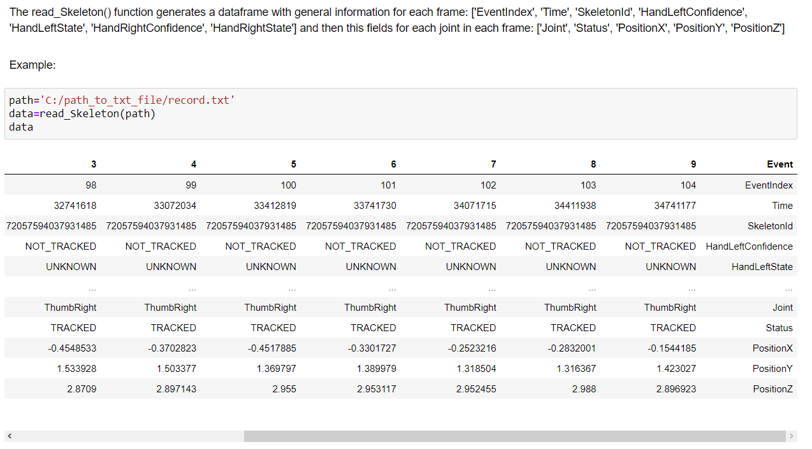
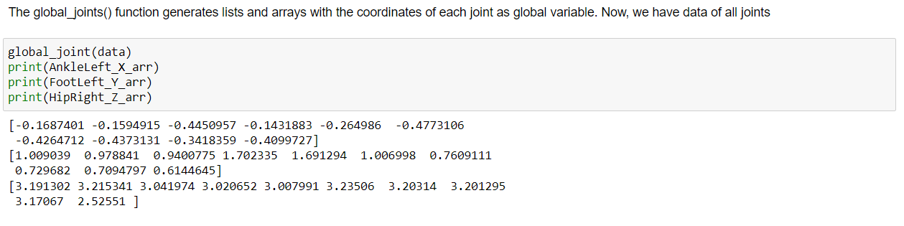
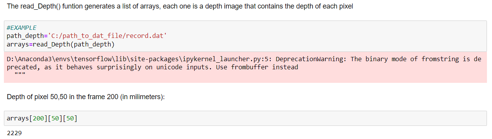

# pyKinectJoints
Obtain joints  and other data from .xef files recorded with Kinect v2

For extract data from Kinect v2, read the .xef record file from Kinect Studio 2.0 with KinectXEFTools https://github.com/Isaac-W/KinectXEFTools

Example in Windows:

Execute xefextract from KinectXEFTools repository:

(base) C:\path_to_repository\KinectXEFTools-master\examples\XEFExtract\bin\Release\netcoreapp2.1\win10-x64>xefextract C:\path_to_xef_file\record.xef

This generates several files, one of them a .txt file containing the information of the skeleton points.

Use ReadKinectXEFToolsDataGH to read the files and extract the information

